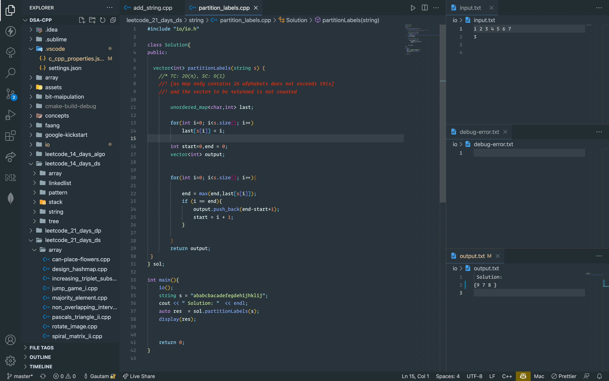

# setup for vscode

### pre-requisites

- install gcc g++ on mac and linux

- install MINGW on windows latest version

- install vscode extension [platform-settings](https://marketplace.visualstudio.com/items?itemName=runarsf.platform-settings)

- install vscode extension [c/c++ extension](https://marketplace.visualstudio.com/items?itemName=ms-vscode.cpptools)

- install vscode extension [code runner](https://marketplace.visualstudio.com/items?itemName=formulahendry.code-runner)

- FOR WINDOWS USERS ONLY - install Git bash 


## for linux users

- go to folder .vscode in this project and open settings.json

- next find the block that looks like the one below

```json

	"linux": {
      "inherits": "darwin",
      "nodes": {
        "code-runner.executorMap": {
          "cpp": "cd $dir && clang++ -std=c++17 -I/<ABSOLUTE PATH> $fileName -o ./out && ./out && rm ./out",
          "java": "cd $dir && javac $fileName && java $fileNameWithoutExt && rm $fileNameWithoutExt.class"
        }
      }
    }
```

- over here add your absolute/full path to this project that is the root directory of this project in place of \<ABSOLUTE PATH\>. Remember to remove the angle brackets


#### next

- now open c_cpp_properties.json in the .vscode folder and find the block below

```json

	{
      "name": "Linux",
      "includePath": [
        "${workspaceFolder}/**",
        "<ABSOLUTE PATH>"
      ],
      "defines": [],
      "compilerPath": "<GCC PATH>",
      "cStandard": "gnu17",
      "cppStandard": "gnu++17",
      "intelliSenseMode": "linux-clang-x64"
    }
```

- over here add your <ABSOLUTE PATH> as did earlier. Remember to remove the angle brackets
- then add the gcc path [for gcc path head over to terminal and write ' which gcc ' and the path that appears is your gcc path] to <GCC PATH>. Remember to remove the angle brackets


#### at last open io.h in folder io

```cpp

void io() {
#ifndef ONLINE_JUDGE

  freopen("<ABSOLUTE PATH>/io/input.txt", "r", stdin);
  freopen("<ABSOLUTE PATH>/io/output.txt", "w", stdout);
  freopen("<ABSOLUTE PATH>/io/debug-error.txt", "w", stderr);


#endif
}

```

- over here add your <ABSOLUTE PATH> as did earlier. Remember to remove the angle brackets


## for mac users

- make sure u have bits included in the include folder, simply saying u can use #include<bits/stdc++.h> without any error.

- if above step does not give any error then 

- go to folder .vscode in this project and open settings.json

- next find the block that looks like the one below

```json

	"darwin": {
      "nodes": {
        "code-runner.executorMap": {
          "cpp": "cd $dir && clang++ -std=c++17 -I/<ABSOLUTE PATH> $fileName -o ./out && ./out && rm ./out",
          "java": "cd $dir && javac $fileName && java $fileNameWithoutExt && rm $fileNameWithoutExt.class"
        }
      }
    },
```

- over here add your absolute/full path to this project that is the root directory of this project in place of <ABSOLUTE PATH>. Remember to remove the angle brackets


#### next

- now open c_cpp_properties.json in the .vscode folder and find the block below

```json

	{
      "name": "Mac",
      "includePath": ["<ABSOLUTE PATH>"],
      "defines": [],
      "macFrameworkPath": [],
      "cStandard": "gnu17",
      "cppStandard": "gnu++17",
      "intelliSenseMode": "<INTELLISENSE MODE>",
      "compilerArgs": [],
      "mergeConfigurations": false,
      "compilerPath": "<G++-11 PATH>"
    },
```

- over here add your <ABSOLUTE PATH> as did earlier. Remember to remove the angle brackets
- then add the gcc path [for gcc path head over to terminal and write ' which g++-11 ' and the path that appears is your gcc path] to <G++-11 PATH>. Remember to remove the angle brackets


#### at last open io.h in folder io

```cpp

void io() {
#ifndef ONLINE_JUDGE

  freopen("<ABSOLUTE PATH>/io/input.txt", "r", stdin);
  freopen("<ABSOLUTE PATH>/io/output.txt", "w", stdout);
  freopen("<ABSOLUTE PATH>/io/debug-error.txt", "w", stderr);


#endif
}

```

- over here add your <ABSOLUTE PATH> as did earlier. Remember to remove the angle brackets


## for windows users


- go to folder .vscode in this project and open settings.json

- next find the block that looks like the one below

```json

	"win32":{
      "inherits": "linux",
      "nodes": {
        "code-runner.executorMap": {
          "cpp": "cd $dirWithoutTrailingSlash && g++ $fileName -o ./out -I/<ABSOLUTE PATH> && ./out.exe && rm ./out.exe",
          "java": "cd $dir && javac $fileName && java $fileNameWithoutExt && rm $fileNameWithoutExt.class"
        },
        "terminal.integrated.shell.windows": "C:\\Program Files\\Git\\bin\\bash.exe",
      }
    }
```

- over here add your absolute/full path to this project that is the root directory of this project in place of <ABSOLUTE PATH>. Remember to remove the angle brackets

- NOTE: if your <ABSOLUTE PATH> is "C:\\something\\" remember to make it "c:/something/"

- NOTE: the path for ***"terminal.integrated.shell.windows:"*** has been set by default if your git is installed somewhere else provide that exact location to git bash. if installed on C: drive you are good to go


#### next

- now open c_cpp_properties.json in the .vscode folder and find the block below

```json

	{
      "name": "Win32",
      "includePath": [
        "${workspaceFolder}/**",
        "<ABSOLUTE PATH with double bashslash>"
      ],
      "defines": [],
      "compilerPath": "C:\\MINGW\\bin\\gcc.exe",
      "cStandard": "gnu17",
      "cppStandard": "gnu++17",
      "intelliSenseMode": "windows-gcc-x64"
    }
```

- over here add your <ABSOLUTE PATH> as did earlier. Remember to remove the angle brackets

- then add the gcc path [for gcc path head over to terminal and write ' which g++-11 ' and the path that appears is your gcc path] to <G++-11 PATH>. Remember to remove the angle brackets

- NOTE: the path for ***"compilerPath:"*** has been set by default if your MINGW is installed somewhere else provide that exact location to gcc.exe. if installed on C: drive you are good to go

#### at last open io.h in folder io

```cpp

void io() {
#ifndef ONLINE_JUDGE

  freopen("<ABSOLUTE PATH  with double backslash>/io/input.txt", "r", stdin);
  freopen("<ABSOLUTE PATH with double backslash>/io/output.txt", "w", stdout);
  freopen("<ABSOLUTE PATH with double backslash>/io/debug-error.txt", "w", stderr);


#endif
}

```

- over here add your <ABSOLUTE PATH> as did earlier. Remember to remove the angle brackets


### Regards you can now access a whole lot of user defined templates to use in your cpp files

#### do setup vscode like this to see the input and output scenario


#### after you are done with the setup open c cpp file and click on run button to see output in output.txt


## Authors

- [@devgautam2000](https://www.github.com/devgautam2000)


## Support

For support, email devgautam1231@gmail.com or create an issue.

